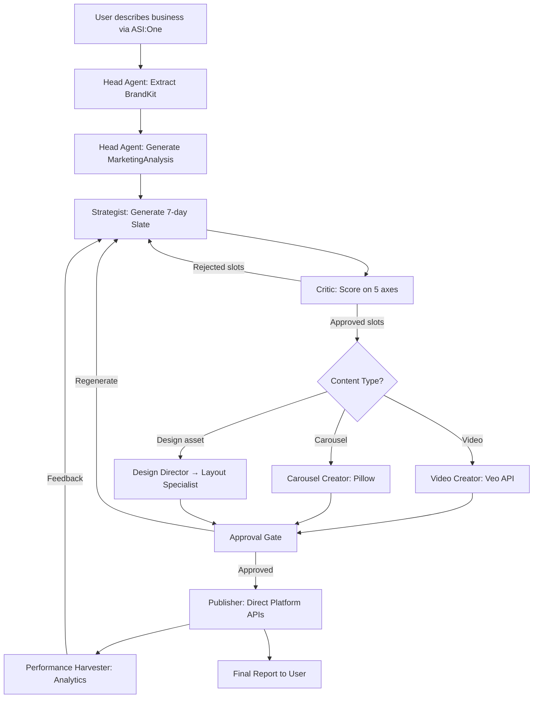
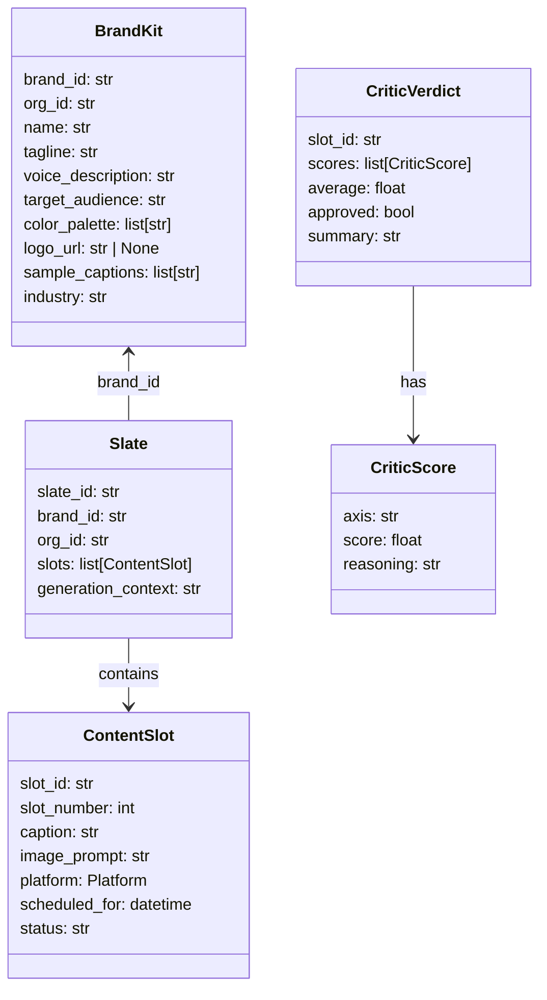

<p align="center">
  <strong>AgentBuffer</strong>
</p>

<p align="center">
  <em>Buffer for autonomous brand agents. You hire AI agents, not write posts.</em>
</p>

<p align="center">
  <a href="#architecture">Architecture</a> &middot;
  <a href="#agent-roster">Agent Roster</a> &middot;
  <a href="#pipeline-flow">Pipeline Flow</a> &middot;
  <a href="#data-models">Data Models</a> &middot;
  <a href="#mcp-server">MCP Server</a> &middot;
  <a href="#quick-start">Quick Start</a> &middot;
  <a href="#development">Development</a>
</p>

---

## Overview

AgentBuffer is a multi-agent marketing automation platform built on [Fetch.ai's Agentverse](https://agentverse.ai). A business describes itself in natural language via [ASI:One](https://asi1.ai), and a team of AI agents autonomously generates a complete marketing strategy, creates platform-optimized content (video, carousels, images), quality-checks every piece, and schedules publishing across social platforms.

**Key capabilities:**
- Natural-language brand onboarding via ASI:One chat
- LLM-powered marketing analysis and content strategy
- 5-axis quality scoring with mandatory rejection of weak content
- Platform-optimized video generation via Google Veo
- Automated carousel/slideshow rendering with Pillow
- Autonomous design asset creation (banners, headers, infographics)
- Multi-platform publishing via direct platform APIs (LinkedIn, X, Instagram, TikTok, YouTube, Bluesky)
- Performance feedback loop for data-driven content optimization
- Human-in-the-loop approval gate before publishing
- MCP Server for enterprise AI agent integration

---

## Architecture

```
                         ┌──────────────────────────┐
                         │        ASI:One            │
                         │  User chats here to       │
                         │  trigger marketing flows  │
                         └─────────────┬────────────┘
                                       │ Chat Protocol
                                       ▼
              ┌──────────────────────────────────────────────┐
              │          HEAD AGENT (Orchestrator)            │
              │  "Marketing Director"                        │
              │                                              │
              │  • Parses business description → BrandKit    │
              │  • Generates MarketingAnalysis via LLM       │
              │  • Dispatches sub-agents in sequence         │
              │  • Streams real-time progress to user        │
              │  • Manages approval gate before publishing   │
              │  • Compiles final campaign report            │
              └──┬────────┬────────┬────────┬────────┬──────┘
                 │        │        │        │        │
        ┌────────┘   ┌────┘   ┌────┘   ┌────┘   ┌───┘
        ▼            ▼        ▼        ▼        ▼
 ┌────────────┐ ┌────────┐ ┌──────────┐ ┌──────────┐ ┌──────────┐
 │ STRATEGIST │ │ CRITIC │ │  VIDEO   │ │ CAROUSEL │ │PUBLISHER │
 │            │ │        │ │ CREATOR  │ │ CREATOR  │ │          │
 │ 7-day     │ │ 5-axis │ │ Google   │ │ Pillow   │ │ Direct   │
 │ content   │ │ rubric │ │ Veo API  │ │ renderer │ │ multi-   │
 │ slates    │ │ rejects│ │ per-plat │ │ 1080x1350│ │ platform │
 │ via LLM   │ │ weak   │ │ trends   │ │ slides   │ │ posts    │
 └────────────┘ └────────┘ └──────────┘ └──────────┘ └──────────┘
                                │
                      ┌─────────┘
                      ▼
            ┌───────────────────┐     ┌──────────────────────┐
            │  DESIGN DIRECTOR  │     │ PERFORMANCE          │
            │                   │     │ HARVESTER            │
            │  Interprets       │     │                      │
            │  design requests  │     │ Daily platform       │
            │  & delegates to   │     │ analytics → feedback │
            │  specialists      │     │ loop to Strategist   │
            └────────┬──────────┘     └──────────────────────┘
                     │
                     ▼
            ┌─────────────────┐
            │ LAYOUT          │
            │ SPECIALIST      │
            │                 │
            │ Renders banners,│
            │ headers, assets │
            └─────────────────┘
```

All agents are registered on [Agentverse](https://agentverse.ai) with the mandatory **Chat Protocol**, making them discoverable and usable through ASI:One.

---

## Agent Roster

| Agent | Role | Directory | Port |
|---|---|---|---|
| **Marketing Director** (Head Agent) | Orchestrator — parses brands, generates analysis, dispatches sub-agents, manages approval gate, compiles reports | `services/head_agent/` | 8001 |
| **Strategist** | Generates 7-day content slates with platform-optimized captions and image/video prompts | `services/strategist/` | 8002 |
| **Critic** | 5-axis quality scoring; must reject at least 1 slot per slate | `services/critic/` | 8003 |
| **Video Creator** | Platform-specific video generation via Google Veo with trend adaptation | `services/video_creator/` | 8004 |
| **Publisher** | Multi-platform publishing and scheduling via direct platform APIs | `services/publisher/` | 8005 |
| **Performance Harvester** | Daily scheduled agent that fetches platform analytics and builds performance summaries | `services/performance_harvester/` | 8006 |
| **Carousel Creator** | Paginates marketing copy into 5-10 slide narratives and renders 1080x1350 PNGs | `services/carousel_creator/` | — |
| **Design Director** | Interprets design requests, classifies task types, builds execution plans, delegates to specialists | `services/design_director/` | — |
| **Layout Specialist** | Renders pixel-perfect marketing assets (banners, headers, infographics) using Pillow | `services/design_specialists/` | — |

---

## Pipeline Flow



### Stage Details

| Stage | Description | Key Operation |
|---|---|---|
| **1. Intake** | User sends a free-form business description | LLM extracts structured `BrandKit` (name, industry, voice, audience, palette) |
| **2. Analysis** | Generate competitive marketing analysis | LLM produces `MarketingAnalysis` with positioning, differentiators, platform recommendations |
| **3. Strategize** | Create a weekly content plan | LLM generates a 7-slot `Slate` with captions and image prompts across recommended platforms |
| **4. Critique** | Quality gate — 5-axis scoring rubric | Each slot scored on Brand Voice, Visual Coherence, Platform Fit, Audience Relevance, Originality. At least 1 slot must be rejected |
| **5. Create** | Generate media assets | Video Creator (Veo), Carousel Creator (Pillow), or Design Director routes based on content type |
| **6. Approval** | Human-in-the-loop review | Content preview queue; users can approve, skip, or request regeneration per slot |
| **7. Publish** | Cross-platform distribution | Direct platform APIs schedule posts with idempotency keys and dead-letter handling |
| **8. Report** | Final campaign summary | Compiled report sent back to user via ASI:One chat |

---

## Data Models

All shared models live in [`services/shared/models.py`](services/shared/models.py) as the single source of truth.

### Core Content Models



### Critic Scoring Axes

| Axis | Description | Threshold |
|---|---|---|
| Brand Voice Alignment | Does the caption match the brand's tone/voice? | Avg >= 3.5 |
| Visual Coherence | Does the image prompt align with the brand aesthetic? | Avg >= 3.5 |
| Platform Fit | Is the content native to the target platform? | Avg >= 3.5 |
| Audience Relevance | Will this resonate with the target audience? | Avg >= 3.5 |
| Originality | Is this fresh and unique, or generic? | Avg >= 3.5 |

Slots with an average score below **3.5/5.0** are rejected. The Critic must reject at least 1 slot per slate to enforce quality standards.

### Video & Carousel Models

| Model | Purpose |
|---|---|
| `TrendContext` | Per-platform trending topics, style hints, hook types, audio cues |
| `VideoRequest` | Veo-ready prompt with aspect ratio, platform, brand context, duration |
| `VideoResult` | Generated video metadata (URL, local path, status, errors) |
| `SlideContent` | Single carousel slide (hook/body/cta) with headline and body text |
| `CarouselResult` | Generated carousel metadata (slide paths, output dir, status) |

### Design System Models

| Model | Purpose |
|---|---|
| `DesignTaskType` | Enum: `logo_variation`, `marketing_header`, `infographic`, `social_rebrand` |
| `DesignRequest` | Task description + type + BrandKit + platform + custom inputs |
| `DesignPlan` | Execution graph: ordered `PlanStep[]` with dependencies |
| `PlanStep` | Single step: agent name, action, params, dependencies |
| `SpecialistResult` | Output paths, success/error status per step |

### Inter-Agent Communication

All agents communicate via **`AgentEnvelope`** — a standardized JSON wrapper:

```python
class AgentEnvelope(BaseModel):
    from_agent: str      # sender agent name
    to_agent: str        # recipient agent name
    envelope_type: str   # message type (e.g., "design_request", "video_results")
    payload: dict        # typed payload
    signature: str       # verification signature
    timestamp: datetime
```

| Envelope Type | From | To | Payload |
|---|---|---|---|
| `design_request` | strategist / user | design_director | `DesignRequest` |
| `design_complete` | design_director | caller | `SpecialistResult[]` |
| `video_results` | video_creator | publisher | `VideoResult[]` |
| `carousel_results` | carousel_creator | publisher | `CarouselResult[]` |

### Performance & Feedback Models

| Model | Purpose |
|---|---|
| `PerformanceRecord` | Per-post analytics: likes, shares, comments, reach, engagement rate |
| `BrandPerformanceSummary` | Aggregated insights: top formats, best posting times, patterns to avoid |
| `ApprovalQueueItem` | Content preview item with critic score and approval status |
| `ApprovalDecision` | User action on a queued item: approve, skip, or regenerate |

---

## Video Pipeline

The Video Creator integrates with **Google Veo** for AI video generation with platform-specific optimization:

| Platform | Aspect Ratio | Style |
|---|---|---|
| TikTok | 9:16 | Fast visual hook in first 2s, trending audio cues, vertical |
| YouTube | 16:9 | Narrative-driven, brand intro, longer story arc, horizontal |
| Instagram | 9:16 | Reels-optimized, aesthetic focus, trending audio, vertical |
| LinkedIn | 16:9 | Professional, data-driven visuals, talking-head with B-roll |
| X | 16:9 | Punchy and concise under 60s, bold text overlays |

**Reliability:**
- Exponential backoff polling (10s initial, 120s max, 10min timeout)
- Up to 3 retries per video
- All errors encapsulated in `VideoResult` — pipeline never crashes
- Downloads `.mp4` to `output/videos/`

---

## Carousel Pipeline

The Carousel Creator generates multi-slide image carousels for Instagram and LinkedIn:

1. **Narrative Pagination** — splits caption into a 5-to-10 slide sequence:
   - Slide 1: **Hook** (first sentence or brand tagline)
   - Slides 2..N-1: **Body** (remaining content, word-wrapped at 120 chars)
   - Slide N: **CTA** (call to action from brand sample captions)

2. **Slide Rendering** (1080x1350 PNG, 4:5 aspect ratio):
   - Background: brand primary color
   - Accent bar: 80px top strip in secondary color
   - Logo: top-right corner (max 120x120)
   - Headline: bold 48pt, centered upper third
   - Body: regular 32pt, centered middle
   - Slide badge: numbered circle, bottom-left

---

## Design System

The **Design Director** + **Layout Specialist** form an autonomous design sub-system:

### Task Classification

| Task Type | Trigger Keywords | Pipeline |
|---|---|---|
| `logo_variation` | logo, icon, mark, emblem | Logo Maker |
| `marketing_header` | header, banner, cover, hero | Layout Specialist |
| `infographic` | infographic, data visual, chart | Layout Specialist |
| `social_rebrand` | rebrand, refresh, redesign | Logo Maker → Layout |

### Platform Dimensions

| Platform | Width | Height | Use Case |
|---|---|---|---|
| LinkedIn | 1200 | 628 | Feed / header |
| X | 1200 | 675 | Card image |
| Instagram | 1080 | 1080 | Square post |

### Layout Algorithm

All vertical positions are computed as cumulative offsets — no hardcoded coordinates. If content overflows, font sizes are iteratively reduced (min 14px) until the layout fits. This guarantees no overlap regardless of input text length.

---

## MCP Server

AgentBuffer exposes its capabilities as an **MCP (Model Context Protocol)** server, enabling external enterprise AI agents to trigger and monitor marketing campaigns programmatically.

**Transport:** SSE (Server-Sent Events) over FastAPI  
**Auth:** API key middleware (`MCP_API_KEYS` environment variable)

### Tools

| Tool | Description | Input |
|---|---|---|
| `generate_social_campaign` | Triggers the full multi-agent pipeline | `product_description`, `target_platform`, `content_type`, `brand_voice`, `num_posts` |
| `get_campaign_status` | Polls campaign pipeline progress | `campaign_id` |

### Running the MCP Server

```bash
MCP_API_KEYS=your-key-here uvicorn src.mcp_server.server:app --host 0.0.0.0 --port 8100
```

**Endpoints:**
- `GET /health` — unauthenticated health check
- `GET /sse` — SSE connection for MCP sessions
- `POST /messages/` — MCP message transport

---

## Performance Feedback Loop

The **Performance Harvester** closes the optimization loop:

1. Runs daily via uAgents scheduling
2. Fetches analytics from platform APIs for posts published in the last 7 days
3. Stores `PerformanceRecord` per post (likes, shares, comments, reach, engagement rate)
4. Builds `BrandPerformanceSummary` with:
   - **Top formats**: best content types by engagement rate per platform
   - **Best times**: optimal day-of-week and hour for posting per platform
   - **Avoid patterns**: content patterns in the bottom 25th percentile
5. Head Agent injects this summary into Strategist context for data-driven slate generation

---

## Project Structure

```
AgentBuffer/
├── services/
│   ├── head_agent/               # Orchestrator agent (entry point)
│   │   ├── agent.py              # State-machine pipeline, Chat Protocol handler
│   │   ├── analysis.py           # LLM-powered brand extraction & marketing analysis
│   │   └── config.py             # Centralized env config
│   ├── strategist/               # Content planning agent
│   │   └── agent.py              # 7-day slate generation via LLM
│   ├── critic/                   # Quality control agent
│   │   └── agent.py              # 5-axis scoring rubric, mandatory rejection
│   ├── video_creator/            # Video generation agent
│   │   ├── agent.py              # Sub-agent entry, receives ApprovedSlate
│   │   ├── veo_client.py         # Google Veo SDK wrapper (submit, poll, download)
│   │   ├── trends.py             # Platform trend adaptation engine
│   │   └── config.py             # Veo settings (polling, retries, aspect ratios)
│   ├── carousel_creator/         # Carousel image pipeline
│   │   ├── agent.py              # Sub-agent entry, filters Instagram/LinkedIn slots
│   │   ├── pagination.py         # Narrative pagination engine (5-10 slides)
│   │   └── renderer.py           # Pillow-based 1080x1350 image renderer
│   ├── publisher/                # Social media distribution
│   │   └── agent.py              # Direct platform API integration with idempotency
│   ├── performance_harvester/    # Analytics feedback loop
│   │   ├── agent.py              # Daily platform analytics fetcher
│   │   └── summary.py            # BrandPerformanceSummary builder
│   ├── design_director/          # Autonomous design planner
│   │   ├── main.py               # Director entry: handle_request()
│   │   ├── planner.py            # Task classification → DesignPlan
│   │   └── registry.py           # Specialist agent registry
│   ├── design_specialists/       # Design rendering agents
│   │   ├── layout_specialist.py  # Marketing asset renderer
│   │   └── common/               # Shared Pillow utilities
│   │       ├── brand_presets.py   # BrandPreset from BrandKit
│   │       ├── canvas.py          # Canvas creation, logo placement, CTA buttons
│   │       └── text_layout.py     # Dynamic text wrapping & measurement
│   └── shared/                   # Shared Pydantic models
│       ├── models.py             # Single source of truth for all data models
│       └── envelope.py           # Envelope signing utilities
├── src/
│   └── mcp_server/               # MCP Server (SSE + FastAPI)
│       ├── server.py             # MCP endpoint wiring
│       ├── tools.py              # Tool handlers
│       ├── models.py             # CampaignRequest/Response schemas
│       └── auth.py               # API key middleware
├── apps/web/                     # Next.js 16 dashboard (React 19, Tailwind, Supabase auth)
├── gateway/                      # FastAPI gateway
├── supabase/migrations/          # PostgreSQL schema (organizations, brands, content_slots, etc.)
├── docs/                         # Design documents
│   ├── veo_pipeline.md
│   ├── carousel_pipeline.md
│   ├── design_agent_architecture.md
│   └── mcp_integration.md
├── pyproject.toml                # Root config (uv workspace)
└── .github/workflows/ci.yml     # CI: lint + test
```

---

## Tech Stack

| Layer | Technology |
|---|---|
| **Agent Framework** | [Fetch.ai uAgents](https://fetch.ai/docs) + Agentverse Chat Protocol |
| **LLM** | [ASI:One](https://asi1.ai) (OpenAI-compatible API) |
| **Video Generation** | [Google Veo](https://deepmind.google/technologies/veo/) via `google-genai` SDK |
| **Image Rendering** | [Pillow](https://pillow.readthedocs.io/) (carousel slides + marketing assets) |
| **Publishing** | Direct Platform APIs (X, Instagram, LinkedIn, TikTok, YouTube, Bluesky) |
| **MCP Server** | [Model Context Protocol](https://modelcontextprotocol.io/) + FastAPI + SSE |
| **Frontend** | Next.js 16, React 19, Tailwind CSS |
| **Database** | [Supabase](https://supabase.com/) (PostgreSQL + Row Level Security) |
| **Auth** | Supabase Auth (JWT with org_id scoping) |
| **Package Management** | [uv](https://github.com/astral-sh/uv) (Python workspace), [pnpm](https://pnpm.io/) (Node) |
| **Linting** | [Ruff](https://docs.astral.sh/ruff/) (Python), ESLint (TypeScript) |
| **CI** | GitHub Actions |

---

## Database Schema

The Supabase PostgreSQL database uses Row Level Security (RLS) with org_id isolation:

| Table | Purpose |
|---|---|
| `organizations` | Tenant organizations |
| `brands` | Brand profiles with JSONB `brand_kit`, logo URL, social links |
| `content_slots` | Individual content pieces (7 per slate) with status lifecycle: `draft → proposed → approved → published` |
| `agent_messages` | Inter-agent message ledger (from_agent, to_agent, envelope_type, payload) |
| `dead_letters` | Failed publish attempts for retry/debugging |

Supported platforms: `linkedin`, `x`, `instagram`, `tiktok`, `youtube`, `bluesky`

---

## Quick Start

### Prerequisites

- Python 3.12+
- [uv](https://github.com/astral-sh/uv) (Python package manager)
- Node 20+ and pnpm 9+ (for the web dashboard)

### 1. Install dependencies

```bash
# Python (from repo root)
uv sync

# Web dashboard
cd apps/web && pnpm install
```

### 2. Configure environment

```bash
cp .env.example .env
# Edit .env with your API keys (see below)
```

**Required keys:**
| Key | Service | Purpose |
|---|---|---|
| `ASI_ONE_API_KEY` | [ASI:One](https://asi1.ai) | LLM for brand analysis, strategy, and critique |
| `GOOGLE_AI_API_KEY` | Google Cloud | Veo video generation |
| `X_API_KEY` / `INSTAGRAM_ACCESS_TOKEN` / etc. | Platform APIs | Social media publishing (see `.env.example` for full list) |
| `NEXT_PUBLIC_SUPABASE_URL` | Supabase | Database and auth |
| `NEXT_PUBLIC_SUPABASE_ANON_KEY` | Supabase | Client-side auth |

### 3. Run agents

```bash
# All-in-one inline mode (all agents in one process)
PYTHONPATH=. python services/head_agent/agent.py

# Or distributed mode (each agent as a separate process)
PYTHONPATH=. python services/strategist/agent.py &
PYTHONPATH=. python services/critic/agent.py &
PYTHONPATH=. python services/video_creator/agent.py &
PYTHONPATH=. python services/publisher/agent.py &
PYTHONPATH=. python services/head_agent/agent.py
```

### 4. Run MCP Server (optional)

```bash
MCP_API_KEYS=your-key uvicorn src.mcp_server.server:app --host 0.0.0.0 --port 8100
```

### 5. Run web dashboard (optional)

```bash
cd apps/web && pnpm dev
```

---

## Development

### Linting

```bash
# Python
uv run ruff check services/ gateway/
uv run ruff format --check services/ gateway/

# Web
cd apps/web && pnpm lint && pnpm typecheck
```

### Testing

```bash
# All Python tests
PYTHONPATH=. uv run pytest services/video_creator/tests/ services/carousel_creator/tests/ services/design_director/tests/ services/design_specialists/tests/ -v

# Individual suites
PYTHONPATH=. uv run pytest services/video_creator/tests/ -v
PYTHONPATH=. uv run pytest services/carousel_creator/tests/ -v
PYTHONPATH=. uv run pytest services/design_director/tests/ services/design_specialists/tests/ -v
```

### CI Pipeline

The [GitHub Actions CI](.github/workflows/ci.yml) runs on every push/PR to `main`:

| Job | What it does |
|---|---|
| `lint-web` | `pnpm lint` + `pnpm typecheck` in `apps/web/` |
| `lint-python` | `ruff check` + `ruff format --check` on `services/` and `gateway/` |
| `test-publisher` | Publisher service tests |
| `test-design` | Design Director + Layout Specialist tests |
| `test-carousel` | Carousel Creator tests |

---

## Hackathon: Fetch.ai Agentverse Prize

This project demonstrates:
- **Multi-agent orchestration** with reasoning, tool execution, and state machine management
- **All agents registered on Agentverse** with mandatory Chat Protocol
- **Discoverable and usable through ASI:One** — no custom frontend required
- **Real-world problem**: automated marketing content pipeline for businesses
- **Quality enforcement**: Critic agent with mandatory rejection and 5-axis scoring
- **Platform-native content**: trend-adapted video and carousel generation per platform

---

## License

[MIT](LICENSE) &copy; 2026 AgentBuffer
