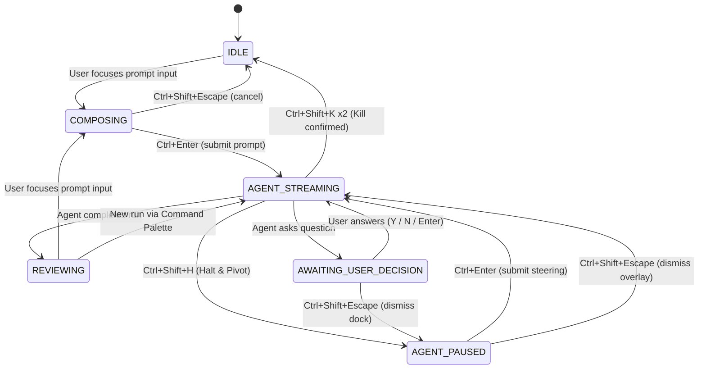

# Browser Interaction State Machine & Focus Management

> Finite state machine governing the AgentBuffer web dashboard UI — defines every
> legal state, transition, focus-management rule, and accessibility contract for
> the keyboard-centric agent streaming interface.

---

## 1. Overview

The AgentBuffer dashboard is a single-page application that moves through a
strict set of UI states as the user composes prompts, watches agent output
stream in, steers the agent mid-run, answers agent questions, and reviews
completed runs. A global finite state machine (FSM) sits at the root of the
React component tree and is the **sole authority** on which keybinds are active,
which DOM elements receive focus, and which regions of the page are interactive.

Every keyboard chord, every focus trap, and every ARIA announcement is gated by
the current FSM state. Nothing fires "globally" — the global keydown listener
inspects the state before deciding whether to act or pass the event through.

---

## 2. State Machine Definition

### 2.1 States

| State                    | Description                                                                                                      |
|--------------------------|------------------------------------------------------------------------------------------------------------------|
| `IDLE`                   | No agent activity. The user can freely navigate the dashboard, type in text areas, and use standard browser shortcuts. |
| `COMPOSING`              | The user is actively typing a prompt to send to the agent. Focus is trapped in the text input. Only submission and cancel chords are active. |
| `AGENT_STREAMING`        | An agent is actively generating/streaming output. Operational keybinds (Halt & Pivot, Approve, Kill) become active. The prompt text input is disabled. |
| `AGENT_PAUSED`           | Generation is paused (e.g., after Halt & Pivot). An inline steering input overlay is visible. Focus is trapped in the overlay input. |
| `AWAITING_USER_DECISION` | The agent has paused and asked the user a question. A Decision Dock panel is displayed with focus-locked selection. |
| `REVIEWING`              | Agent run is complete. The user is reviewing output. Navigation and annotation keybinds are active.              |

### 2.2 State Invariants

Each state enforces a set of invariants that **must** hold while the FSM is in
that state:

- **`IDLE`** — No focus traps. No `inert` attributes on any section. All
  browser shortcuts pass through unimpeded.
- **`COMPOSING`** — The prompt textarea has focus. Background content is marked
  `inert`. Only `Ctrl+Enter` (submit) and `Ctrl+Shift+Escape` (cancel) are
  intercepted; everything else is passed to the textarea.
- **`AGENT_STREAMING`** — The prompt textarea is `disabled`. The streaming
  output region has `aria-live="polite"`. Operational chords (`Ctrl+Shift+H`,
  `Ctrl+Shift+A`, `Ctrl+Shift+K`) are intercepted.
- **`AGENT_PAUSED`** — The inline steering input overlay is visible and focused.
  Background content is `inert`. Only the overlay input and its chords are
  active.
- **`AWAITING_USER_DECISION`** — The Decision Dock panel is visible with
  `aria-modal="true"`. Background content is `inert`. Selection and submission
  chords are active.
- **`REVIEWING`** — No focus traps. Navigation chords (Command Palette,
  Pipeline Switcher, Annotation Mode) are active. Browser shortcuts pass
  through.

---

## 3. Transition Table

| Current State            | Event                        | Next State               | Guard / Notes                                                                    |
|--------------------------|------------------------------|--------------------------|----------------------------------------------------------------------------------|
| `IDLE`                   | User focuses prompt input    | `COMPOSING`              | Clicking or tabbing into the prompt textarea triggers the transition.             |
| `COMPOSING`              | User submits prompt          | `AGENT_STREAMING`        | `Ctrl+Enter` in the prompt textarea. Prompt text must be non-empty.              |
| `COMPOSING`              | User cancels composition     | `IDLE`                   | `Ctrl+Shift+Escape`. Prompt text is preserved but input loses focus.             |
| `AGENT_STREAMING`        | Agent completes run          | `REVIEWING`              | The stream closes normally. Output is finalized.                                 |
| `AGENT_STREAMING`        | User triggers Halt & Pivot   | `AGENT_PAUSED`           | `Ctrl+Shift+H`. Generation freezes, inline steering overlay appears.             |
| `AGENT_STREAMING`        | User triggers Approve        | `AGENT_STREAMING`        | `Ctrl+Shift+A`. Force-finalizes current thought; agent continues next step.      |
| `AGENT_STREAMING`        | User triggers Kill (confirm) | `IDLE`                   | `Ctrl+Shift+K` double-tap within 2 s. Agent run is terminated.                  |
| `AGENT_STREAMING`        | Agent asks question           | `AWAITING_USER_DECISION` | Agent emits a decision-request envelope. Decision Dock slides in.                |
| `AGENT_PAUSED`           | User submits steering input  | `AGENT_STREAMING`        | `Ctrl+Enter` in the overlay input. Steering text is sent to the agent.           |
| `AGENT_PAUSED`           | User dismisses overlay       | `AGENT_STREAMING`        | `Ctrl+Shift+Escape`. Agent resumes without steering input.                       |
| `AWAITING_USER_DECISION` | User answers question        | `AGENT_STREAMING`        | `Ctrl+Shift+Y`, `Ctrl+Shift+N`, or `Ctrl+Shift+Enter` on a selection.           |
| `AWAITING_USER_DECISION` | User dismisses Decision Dock | `AGENT_PAUSED`           | `Ctrl+Shift+Escape`. Agent remains paused, no answer is sent.                   |
| `REVIEWING`              | User focuses prompt input    | `COMPOSING`              | Starting a new prompt from the review screen.                                    |
| `REVIEWING`              | User starts new run          | `AGENT_STREAMING`        | Via Command Palette or direct action.                                            |

---

## 4. State Diagram



---

## 5. Focus Management Strategy

### 5.1 Global Keydown Listener

The application registers a **single** global listener:

```
window.addEventListener('keydown', globalHandler)
```

`globalHandler` follows this logic:

```
function globalHandler(event) {
  const chord = toChord(event)            // e.g. "Ctrl+Shift+H"
  const binding = KEYBIND_MAP[chord]      // look up registered binding

  if (!binding) return                    // unknown chord — pass through
  if (!binding.activeInStates.includes(currentState)) return  // not active — pass through

  event.preventDefault()                  // claim the event
  event.stopPropagation()
  binding.handler(event)                  // execute the action
}
```

> **Design philosophy:** The global handler only calls `preventDefault()` for
> recognized chords in the current state. All other keystrokes — including
> browser-reserved shortcuts — pass through untouched. This prevents the app
> from "swallowing" keys the user didn't intend for it.

### 5.2 Focus Trapping

In states that require focus trapping (`COMPOSING`, `AGENT_PAUSED`,
`AWAITING_USER_DECISION`), the following pattern is applied:

1. **`aria-modal="true"`** is set on the focused container (the prompt textarea
   wrapper, the steering overlay, or the Decision Dock).
2. **`inert` attribute** is applied to all sibling content outside the focused
   container. This prevents tabbing, clicking, and assistive-technology
   interaction with background content.
3. **Focus-trap library pattern** — a thin wrapper (inspired by `focus-trap`)
   that:
   - On mount: saves the previously focused element, moves focus to the first
     interactive element inside the trap.
   - On unmount: restores focus to the saved element.
   - Intercepts `Tab` and `Shift+Tab` to cycle focus within the trap boundary.

```
┌─────────────────────────────────────────────────────┐
│  Dashboard (inert when focus trap is active)        │
│  ┌───────────────────────────────────────────────┐  │
│  │  Streaming Output Area                        │  │
│  └───────────────────────────────────────────────┘  │
│  ┌───────────────────────────────────────────────┐  │
│  │  Focus Trap Container  [aria-modal="true"]    │  │
│  │  ┌─────────────────────────────────────────┐  │  │
│  │  │  Interactive Element (textarea / list)  │  │  │
│  │  └─────────────────────────────────────────┘  │  │
│  │  ┌─────────────────────────────────────────┐  │  │
│  │  │  Keybind Hint Bar                       │  │  │
│  │  └─────────────────────────────────────────┘  │  │
│  └───────────────────────────────────────────────┘  │
└─────────────────────────────────────────────────────┘
```

### 5.3 Preventing Browser Shortcut Conflicts

The global handler's guard-first design ensures browser shortcuts are never
accidentally intercepted:

1. **Unrecognized chords** — `globalHandler` returns early, the browser handles
   the event normally (e.g., `Ctrl+T` opens a new tab).
2. **Recognized chords in wrong state** — `globalHandler` returns early, the
   browser handles the event normally (e.g., `Ctrl+K` in `AGENT_STREAMING`
   passes through because Command Palette is only active in `IDLE` /
   `REVIEWING`).
3. **Recognized chords in correct state** — `preventDefault()` is called, the
   app handles the event. This is the **only** path where the browser's default
   behavior is suppressed.

### 5.4 Accessibility Considerations

- **Focus traps are escapable** — Every focus trap includes a deliberate exit
  chord (`Ctrl+Shift+Escape`). `Escape` alone is never used as a dismissal key
  for focus-trapped states to avoid accidental dismissal. (`Escape` is only used
  in non-trapped contexts like the Command Palette where dismissal is safe.)
- **ARIA live regions** — State transitions are announced to screen readers:
  - `AGENT_STREAMING` start: `"Agent is generating output."` via
    `aria-live="assertive"`.
  - `AGENT_PAUSED`: `"Agent paused. Steering input is ready."` via
    `aria-live="assertive"`.
  - `AWAITING_USER_DECISION`: `"Agent is asking a question. Decision panel is
    open."` via `aria-live="assertive"`.
  - `REVIEWING`: `"Agent run complete. Review output."` via
    `aria-live="polite"`.
- **`role` attributes** — The Decision Dock uses `role="dialog"`, the Command
  Palette uses `role="listbox"`, option cards use `role="option"` with
  `aria-selected`.
- **Visible focus indicators** — All interactive elements have a visible
  `:focus-visible` ring. Focus traps use a distinct border color to indicate the
  trapped region.

---

## 6. Guard Conditions

Guard conditions are boolean checks evaluated before a transition is executed.
If the guard returns `false`, the transition is a no-op and the keydown event is
**not** prevented (it passes through to the browser).

| Transition                          | Guard Condition                                                                                            |
|-------------------------------------|------------------------------------------------------------------------------------------------------------|
| `COMPOSING → AGENT_STREAMING`      | `promptText.trim().length > 0` — Cannot submit an empty prompt.                                            |
| `AGENT_STREAMING → AGENT_PAUSED`   | `state === AGENT_STREAMING` — Halt chord is only processed during active streaming.                        |
| `AGENT_STREAMING → IDLE` (Kill)    | `state === AGENT_STREAMING && killArmed === true` — Requires the double-tap confirmation within 2 seconds. |
| `AGENT_PAUSED → AGENT_STREAMING`   | `steeringText.trim().length > 0` (for submit) — Cannot submit empty steering input. Dismiss (Ctrl+Shift+Escape) has no guard. |
| `AWAITING_USER_DECISION → AGENT_STREAMING` | `selectedOption !== null` (for list selections) — An option must be highlighted before confirming.   |
| `REVIEWING → COMPOSING`            | Prompt input element must exist in the DOM and be enabled.                                                 |

### Guard Example: Halt & Pivot in Wrong State

```
User presses Ctrl+Shift+H while in IDLE state:

1. globalHandler fires
2. Looks up "Ctrl+Shift+H" → binding found (Halt & Pivot)
3. Checks binding.activeInStates → ["AGENT_STREAMING"]
4. currentState is "IDLE" → not in active states
5. Returns early — event is NOT prevented
6. Browser processes the keystroke normally (no-op, since Ctrl+Shift+H
   is not a standard browser shortcut)
```

### Guard Example: Kill Double-Tap

```
User presses Ctrl+Shift+K while in AGENT_STREAMING state:

First press:
  1. globalHandler fires
  2. Looks up "Ctrl+Shift+K" → binding found (Kill Process)
  3. currentState is "AGENT_STREAMING" → active
  4. killArmed is false → ARM the kill
     - Set killArmed = true
     - Start 2-second timer
     - Show "Press again to confirm" toast + red pulsing border
  5. preventDefault() — claim the event

Second press (within 2 seconds):
  1. globalHandler fires
  2. killArmed is true → EXECUTE the kill
     - Terminate agent run
     - Transition to IDLE
     - Clear killArmed, cancel timer
     - Show "terminated" badge

Timeout (no second press within 2 seconds):
  1. Timer fires
  2. Set killArmed = false
  3. Remove toast and red pulsing border
  4. Silent disarm — no state transition
```

---

## 7. Implementation Notes

> **This document is a planning artifact.** No application code should be
> written from this document alone — it serves as the specification for the
> frontend state machine implementation.

- The FSM should be implemented as a single `useReducer` (or a lightweight
  state-machine library like XState) at the app root.
- State transitions should be dispatched as typed events, not raw strings.
- The global keydown listener should be registered once in a top-level
  `useEffect` and cleaned up on unmount.
- Focus-trap activation/deactivation should be driven by state changes, not by
  imperative DOM manipulation scattered across components.
- All state transitions should emit analytics events for debugging and UX
  telemetry.
